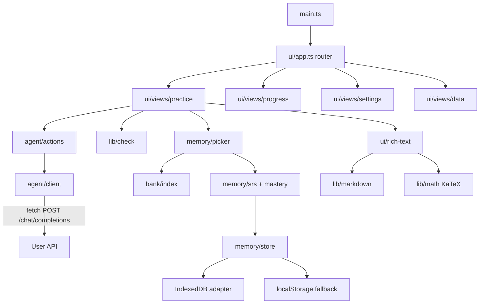
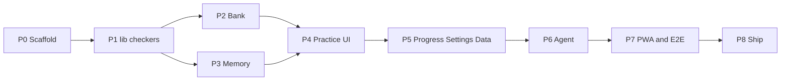

# Discrete Tasks plan

Greenfield implementation plan for Discrete Tasks: a calm, offline-first Vite + vanilla TypeScript PWA with a verified 30-problem bank, local spaced repetition with interleaving, and an optional OpenAI-compatible agent. Work is split into phases, each owned by a project subagent and gated by the repo's checks.

# Discrete Tasks: Implementation Plan

Status: the repo currently contains only the agent setup (`AGENTS.md`, `.cursor/rules`, `.cursor/agents`, `.cursor/commands`, `.cursor/hooks`). There is no app code yet. This plan follows those rules. Where the request goes beyond them, the plan states a decision. The main one: memory moves to IndexedDB, with localStorage as a fallback.

## 1. Goal and user

- **Goal:** a static, installable, offline-first PWA that gives one university-level discrete-math problem at a time. Hints come step by step, answers are checked locally, and a local memory drives interleaving and spaced repetition. An optional AI agent (any OpenAI-compatible API) can generate new problems, give hints about the user's own work, and check proofs.
- **User:** Vladislav, 18, university student, autistic, ADHD, twice-exceptional. He learns through mind maps and interleaving and loves minimalism. The UI is in simple, literal English. The design is dark and calm, with green for primary/success and purple for the agent/hints. One task is in focus. Nothing flashes and there is no timer pressure. Every state change comes from his own action.

## 2. Architecture

- **Stack:** Vite + vanilla strict TypeScript, no UI framework. The only runtime dependency is `katex`, bundled locally.
- **Dev dependencies:** `vite-plugin-pwa`, `workbox-window`, `vitest`, `fake-indexeddb`, `happy-dom` (only for the rich-text DOM tests), `eslint`, `typescript-eslint`, `@eslint/js`, `eslint-config-prettier`, `prettier`, `tsx`, `@playwright/test`.
- **Routing:** hash routes (`#/practice`, `#/progress`, `#/settings`, `#/data`). GitHub Pages needs no 404 fallback with hash routes. The default route is `#/practice`.
- **Base path:** `vite.config.ts` sets `base: '/discrete-tasks/'`. All runtime URLs use `import.meta.env.BASE_URL`.
- **PWA:** `vite-plugin-pwa` in `generateSW` mode with `registerType: 'prompt'`, so the app never reloads on its own. When a new version is ready, a quiet line appears: "A new version is ready. Reload when you want."
  - `injectRegister: 'script'` registers the worker through an external `registerSW.js` file, so no inline script is needed.
  - Precache: `globPatterns: ['**/*.{js,css,html,svg,png,woff2,webmanifest}']`. This covers the app shell, the bank (bundled into the JS) and the KaTeX `woff2` fonts.
  - `navigateFallback: 'index.html'`.
  - No runtime caching. Agent API calls are always network-only.
  - Manifest: `name: 'Discrete Tasks'`, `short_name: 'Discrete'`, `start_url: '/discrete-tasks/'`, `scope: '/discrete-tasks/'`, `display: 'standalone'`, `background_color` and `theme_color` `#0e0f13`. Icons at 192 and 512 px plus a maskable icon, all generated once from `public/icons/icon.svg` and committed. There is also an `apple-touch-icon`.
- **CSP:** a small Vite plugin in `vite.config.ts` (`apply: 'build'`) injects the CSP `<meta>` only in the build, because the Vite dev server injects `<style>` tags:
  `default-src 'self'; script-src 'self'; style-src 'self'; style-src-attr 'unsafe-inline'; font-src 'self'; img-src 'self' data:; connect-src 'self' https:; manifest-src 'self'; worker-src 'self'; object-src 'none'; base-uri 'self'; form-action 'none'`.
  - `connect-src https:` is needed because the API origin is chosen by the user at runtime. A comment in `index.html` and a note in the README explain this.
  - `style-src-attr 'unsafe-inline'` is needed because KaTeX output uses inline `style` attributes. No untrusted HTML is ever injected.



### Module map (each file is about 200 lines or fewer; tests are colocated as `*.test.ts`)

- `src/main.ts`: bootstrap only. Builds the adapters (clock, storage, fetch) and mounts `ui/app.ts`.
- **`src/lib/`** (pure helpers)
  - `result.ts`: the `Result<T, E>` type plus `ok` and `err` helpers.
  - `rational.ts`: an exact BigInt rational type with parse (int, `a/b`, finite decimal), arithmetic, pow and normalisation.
  - `expr/tokenize.ts`, `expr/parse.ts`, `expr/evaluate.ts`: a safe expression engine.
    - Shunting-yard parser to an AST. Supports `+ - * / ^ !`, unary minus, parentheses, implicit multiplication (`2n`, `(n+1)(n+2)`), the variable `n`, and `binom(a,b)` / `C(a,b)`.
    - Evaluation is exact with rationals.
    - Limits: `|exponent| ≤ 4096`, factorial argument ≤ 200, result ≤ 10k digits. Nothing ever goes through `eval` or `Function`.
  - `check/numeric.ts`, `check/expression.ts`, `check/set.ts`, `check/index.ts`: answer checkers that return `CheckResult { status: 'correct' | 'incorrect' | 'unparsed'; message: string; detail?: string }`.
  - `markdown.ts`: a tiny markdown-subset parser (paragraphs, `**bold**`, `*em*`, `` `code` ``, lists, `###` headings) that outputs a token tree. It extracts math (`$$..$$`, `$..$`, escaped `\$`) into math tokens first.
  - `math.ts`: a KaTeX wrapper, `renderMath(tex, display)`, called with `{ trust: false, throwOnError: false, strict: 'ignore', maxSize: 20, maxExpand: 500 }`, plus `isValidTex(tex)` for validation.
  - `random.ts`: a seeded PRNG (mulberry32) and weighted choice.
  - `time.ts`: the `Clock` interface, day math (`endOfLocalDay`, `daysBetween`) and a fake clock for tests.
  - `ids.ts`: id generation from an injected PRNG.
  - `dom.ts`: an `h(tag, attrs, children)` helper that only ever sets text with `textContent`.
- **`src/bank/`**
  - `types.ts`: `Problem`, `Topic`, `AnswerType` (section 3).
  - `topics.ts`: the `Topic` union, labels, id prefixes, and the fixed topic-map edges and node positions.
  - `problems/<topic>.ts`: ten files, three problems each.
  - `index.ts`: the `BANK` array and a `byId` map.
  - `validate.ts`: `validateProblem(x: unknown): Result<Problem, string[]>`. Shared by the bank tests and the agent.
- **`src/memory/`**
  - `schema.ts`: Memory types and `MEMORY_VERSION`.
  - `migrate.ts`: `migrate(raw: unknown): Result<Memory, MigrationError>` (v0 means empty).
  - `storage/adapter.ts`: the `KeyValueStore` interface (`get` / `set` / `remove`, async).
  - `storage/indexeddb.ts`, `storage/local.ts`, `storage/fake.ts` (for tests).
  - `store.ts`: load, migrate, debounced save (500 ms, plus a save on `visibilitychange` to hidden), corrupt-data quarantine and `navigator.storage.persist()`.
  - `quality.ts`: turns an attempt into an SM-2 quality score from 0 to 5.
  - `srs.ts`: the SM-2 card update.
  - `mastery.ts`: per-topic mastery, decay and bands.
  - `picker.ts`: the interleaving picker.
  - `session.ts`: in-memory session state (seen ids, last topics, relearn queue, focus topic).
  - `export.ts`: export and import, including merge.
  - `summary.ts`: a compact memory summary for agent prompts.
- **`src/agent/`**
  - `settings.ts`: the `Settings` schema, presets, load/save to `dt:settings` through an injected storage, and `maskKey`.
  - `errors.ts`: the `AgentError` class with `kind` and a calm `userMessage`.
  - `client.ts`: the only `fetch` call site. Handles timeout, error mapping and JSON-mode fallback.
  - `prompts.ts`: the system and user prompts for each action, with the problem-quality standard embedded.
  - `extract-json.ts`: removes fences, scans for the first balanced, string-aware `{...}` object, and handles the LaTeX backslash repair.
  - `validate-generated.ts`: `validateProblem` plus AI-specific checks (hint leak, small-case cross-check, TeX validity).
  - `actions.ts`: `generateProblem`, `hint`, `check`, `testConnection`.
- **`src/ui/`**
  - CSS: `tokens.css` (exact tokens from `30-design-system.mdc`), `base.css`, `components.css`.
  - `app.ts`: the router and layout shell.
  - `components/`: `top-bar.ts`, `button.ts`, `rich-text.ts` (token tree to DOM; only KaTeX output is set as HTML), `update-prompt.ts`.
  - `keyboard.ts`: global shortcuts, which are off while typing.
  - `active-timer.ts`: counts time only while the tab is visible and there was input in the last 5 minutes.
  - `views/practice.ts` with `practice/answer-box.ts`, `practice/hint-panel.ts`, `practice/result.ts`, `practice/proof-flow.ts`, `practice/why-line.ts`.
  - `views/progress.ts` with `progress/topic-map.ts` (SVG) and `progress/topic-detail.ts`.
  - `views/settings.ts`, `views/data.ts`, `views/session-summary.ts`.
- **`scripts/verify/`**: `<id>.ts` per auto-checkable or brute-forceable problem, `run-all.ts`, and `lib/` (enumerators for subsets, permutations, graphs, Boolean functions, relations).
- **Other files:** `e2e/` (Playwright), `.github/workflows/deploy.yml`, `.env.example` (placeholder only; the app has no build-time env).

## 3. Data model

### Problem (`src/bank/types.ts`)

This is a superset of the interface in `20-problem-quality.mdc`. Phase 2 updates that rule file to match.

```ts
export type Topic = 'combinatorics' | 'graphs' | 'logic' | 'sets' | 'relations'
  | 'induction' | 'recurrences' | 'boolean' | 'number-theory' | 'counting-principles';
export type AnswerType = 'numeric' | 'expression' | 'set' | 'proof';

export interface Answer {
  type: AnswerType;
  canonical?: number | string | Array<number | string>; // required unless 'proof'
  display: string;                // human-readable final answer (LaTeX ok)
  accepted?: string[];            // extra accepted inputs, e.g. alternative labels for set items
  tolerance?: number;             // numeric only, only for genuinely non-rational answers (none in the bank)
  nRange?: [number, number];      // expression only; default [1, 10]
  keyPoints?: string[];           // required for 'proof'
}

export interface Problem {
  id: string;                     // '<prefix>-<nnn>' for bank, 'ai-<prefix>-<base36>' for AI
  source: 'bank' | 'ai';
  topic: Topic;
  subtopics?: string[];
  difficulty: 3 | 4 | 5;
  title: string;
  statement: string;              // markdown + KaTeX
  hints: [string, string, string] | [string, string, string, string];
  solution: string;
  answer: Answer;
  related?: string[];
  estMinutes?: number;
}
```

### Memory (`src/memory/schema.ts`)

```ts
export const MEMORY_VERSION = 1;

export type Outcome = 'correct' | 'partial' | 'incorrect' | 'skipped';

export interface Attempt {
  id: string;
  problemId: string;
  source: 'bank' | 'ai';
  topic: Topic;
  difficulty: 3 | 4 | 5;
  startedAt: number;               // epoch ms
  endedAt: number;
  activeMs: number;                // visible and non-idle time only
  hintsUsed: number;               // local hints revealed
  agentHints: number;
  wrongChecks: number;             // failed checks before the final outcome
  solutionViewed: boolean;
  outcome: Outcome;
  selfAssessment?: 'got' | 'partly' | 'missed'; // proofs
  checkedBy: 'local' | 'agent' | 'self';
  quality: 0 | 1 | 2 | 3 | 4 | 5;  // input to SM-2
  answerText?: string;             // capped at 2000 chars
}

export interface CardState {
  problemId: string;
  ease: number;                    // 1.3..2.8, start 2.5
  intervalDays: number;
  reps: number;
  lapses: number;
  dueAt: number;
  lastSeenAt: number;
  lastOutcome: Outcome;
}

export interface TopicStats {
  topic: Topic;
  attempts: number;
  correct: number;
  mastery: number;                 // 0..1, EMA-based (section 4)
  lastSeenAt: number | null;
  avgActiveMs: number;
  hintsPerAttempt: number;
}

export interface Memory {
  version: 1;
  createdAt: number;
  updatedAt: number;
  attempts: Attempt[];             // never pruned
  cards: Record<string, CardState>;
  topics: Record<Topic, TopicStats>; // derived and cached; can be rebuilt from attempts
  aiProblems: Problem[];           // generated problems; ones with attempts are never pruned
  lastExportAt: number | null;
}
```

### Versioning and migrations

- Every persisted blob has a `version` field. `migrate()` runs step functions `v0 -> v1 -> ...`.
- Unknown or corrupt data is never dropped. The raw value is copied to `dt:memory-corrupt-<timestamp>` in localStorage, the app starts fresh, and it shows a calm notice on the Data screen: "Saved data could not be read. A copy was kept. You can export it."
- `TopicStats` is rebuilt from `attempts` after any migration.

### Export/import format

```json
{
  "app": "discrete-tasks",
  "kind": "memory-export",
  "exportVersion": 1,
  "memoryVersion": 1,
  "exportedAt": "2026-10-08T12:00:00.000Z",
  "memory": { "...": "Memory object" }
}
```

- Exports never include settings or the API key. A test checks this by looking for `dt:settings` fields and key-like strings in the output.
- On import, the file is validated and migrated, then a preview of counts is shown. The user chooses **Merge** (primary) or **Replace** (secondary, asks for confirmation).
  - Merge combines attempts by `id`, keeps the card with the later `lastSeenAt`, and combines `aiProblems` by `id`.
  - Before either action, the current memory is written to `dt:memory-backup`.

## 4. Memory and scheduling

### Quality from an attempt (`quality.ts`)

- Correct on the first check scores 5. Correct after `k` wrong checks scores `max(3, 5 - k)`.
- Hints: one or more hints gives -1, three or more gives another -1. Taking longer than 2x `estMinutes` (by `activeMs`) gives -1. A correct answer never drops below 3, so it never counts as a lapse.
- Proof self-assessment: "Got it" scores 4 (self-assessed answers are capped at 4), "Partly" scores 2, "Missed" scores 1.
- Viewing the solution before a correct answer, or giving up, scores 1. A partial agent verdict scores 2.
- A skip updates nothing in SRS. The problem is excluded for the rest of the session and topic `lastSeenAt` is updated.
- None of these penalties is visible in the UI. Hints are never shown as a cost.

### SM-2 per problem (`srs.ts`)

- If `q >= 3`: the interval is 1 day when `reps == 0`, 3 days when `reps == 1`, and otherwise `round(interval * ease)`. Then `ease += 0.1 - (5-q)(0.08 + (5-q)*0.02)`. `reps` goes up by one.
- If `q < 3`: `reps = 0`, `lapses` goes up, the interval becomes 1 day, `ease -= 0.2`.
- Ease is clamped to `[1.3, 2.8]`. Intervals get a seeded ±10% fuzz from 3 days on, so reviews do not clump.
- A card is due when `dueAt <= endOfLocalDay(now)`. This is day-level granularity.
- **In-session relearn:** after an incorrect outcome, the problem can come back in the same session after at least 4 other problems. A retry does not add a second lapse.

### Per-topic mastery (`mastery.ts`)

- Each attempt gives a score `s = (q/5) * diffWeight`, where `diffWeight` is 0.85 for difficulty 3, 0.95 for 4 and 1.0 for 5.
- `ema = 0.7*ema + 0.3*s`, `confidence = 1 - 0.75^attempts`, `mastery = ema * confidence`.
- The picker uses a decayed value: `mastery * 0.5^(daysSinceSeen/30)`. The UI shows raw bands plus "Last practised N days ago".
- Bands: below 0.25 is "New", below 0.5 "Learning", below 0.75 "Steady", and 0.75 or above "Strong". No percentages, scores or streaks are shown.

### Interleaving picker (`picker.ts`, pure and seeded)

1. **Candidates:**
   - due cards that are not excluded this session;
   - bank problems he has not seen yet;
   - cached AI problems he has not attempted;
   - relearn items that are eligible again.

   If a session focus topic is set, only that topic is kept.
2. **No repeats:** remove candidates whose topic equals the last topic. If nothing is left, because only one topic has anything available, keep the full list. This is the only case where a topic repeats.
3. **Slot:** if there are due reviews, choose "review" with p = 0.6. Otherwise choose "new". If the chosen slot is empty, use the other one.
4. **Score:** `1 + 2*weakness + 1.5*staleness + (review ? 1.5*overdue : 0) + (topicNeverSeen ? 1 : 0)`.
   - `weakness = 1 - decayedMastery`
   - `staleness = min(1, daysSinceTopicSeen/7)`
   - `overdue = min(1, daysOverdue/intervalDays)`
   - The score is multiplied by 0.5 if the topic was seen two problems ago and at least 3 topics are available.
5. **Difficulty for new problems:** the target is 3 for New/Learning, 4 for Steady and 5 for Strong. The score goes down by 1 for each difficulty step away from the target (minimum 0.1).
6. **Choice:** weighted random choice with the seeded PRNG. The picker returns `{ problemId, reason }`.
7. **Never empty:** if no candidates remain, it takes the least recently seen problem as "Extra practice". If the agent is on, it can generate one instead.

The "why" line under the task card is quiet text, for example: "Review. You missed this 6 days ago." or "New. You have not practised graphs for 3 days." A one-line explanation sits on Practice and in Progress: "Topics are mixed on purpose. Past mistakes come back at growing intervals."

### Storage

- **Primary:** IndexedDB database `discrete-tasks` (version 1), store `kv`, key `memory`. A thin wrapper around the raw IDB API.
- **Fallback:** if IndexedDB fails to open (some private modes, old WebViews), localStorage key `dt:memory` is used.
- Settings always live in localStorage `dt:settings`, as the security rule requires. Other keys: `dt:memory-backup`, `dt:memory-corrupt-*`, `dt:ui` (show-timer toggle, last route).
- `navigator.storage.persist()` is requested on the first save. The Data screen shows "Last export: never / N days ago" as a quiet reminder, with no nagging.

## 5. Agent

### Settings (`src/agent/settings.ts`, localStorage `dt:settings`)

```ts
interface Settings {
  version: 1;
  preset: 'nous' | 'openrouter' | 'groq' | 'custom';
  baseUrl: string;
  model: string;
  apiKey: string;
  agentProblems: boolean;
}
```

- `agentProblems` means "Mix in new problems from the agent". It is off by default and is offered after a successful connection test.
- Presets:
  - Nous Portal: `https://inference-api.nousresearch.com/v1`, model `poolside/laguna-s-2.1:free`, `jsonMode: false`.
  - OpenRouter: `https://openrouter.ai/api/v1`, model field empty and required, `jsonMode: false`.
  - Groq: `https://api.groq.com/openai/v1`, model `openai/gpt-oss-120b`, `jsonMode: true`.
  - Custom: every field can be edited.
- Choosing a preset fills in the base URL and model, and both stay editable.
- The key field is a password input. After saving it is shown masked (`sk-…abcd`), with a "Clear key" button.
- The base URL must be `https://`, with one exception: `http://localhost` is allowed for local servers.

### Client (`src/agent/client.ts`)

- Sends `POST {baseUrl}/chat/completions` with the headers `Authorization: Bearer <key>` and `Content-Type: application/json`, and the body `{ model, messages, temperature, max_tokens, response_format? }`.
- Uses an `AbortController` timeout: 45 s for generate, 30 s for hint and check, 15 s for the connection test.
- Reads only `choices[0].message.content`. Empty content becomes a `bad-response` error.
- If the response is a 400 that mentions `response_format`, it retries once without JSON mode and remembers this for the session.
- `AgentError.kind` maps to fixed user messages, taken word for word from `40-security-secrets.mdc` where the rule defines them:
  - `network` (a `TypeError` from fetch): the CORS message.
  - `auth` (401/403): "The API key was rejected. Check it in Settings."
  - `not-found` (404): "Model or endpoint not found. Check the base URL and model name."
  - `rate-limit` (429): "Rate limit reached. Wait a moment and try again."
  - `timeout`: "The agent took too long to answer. Try again, or keep going with the built-in problems."
  - `server` (5xx): "The provider had a problem. Try again later."
  - `invalid-json` and `config` cover a broken model reply and missing settings.
- Error messages, logs and thrown objects never contain the key, the headers or the request body. A test scans every error path for the key.

### Actions (`src/agent/actions.ts`; every action returns a `Result`)

**1. `generateProblem(topic, difficulty, summary)`**
- The prompt contains the quality standard, the Topic list, the exact JSON schema and examples. It tells the model to return a single JSON object with no fences, to double every backslash, to write in English, and to keep the answer out of the hints.
- `summary` (from `memory/summary.ts`) contains the topic band, the titles of the last 10 problems in that topic (to avoid duplicates), and short notes on recent mistakes.
- The model returns `Problem` fields without `id` and `source`. For `expression` answers it also returns `smallCases: [{ n, value }]` for 4 values of n.
- Parsing pipeline:
  1. Remove code fences.
  2. Extract the first balanced object with a scanner that tracks strings.
  3. Repair: remove trailing commas; double single backslashes before letters that are not JSON escapes; for `\b \f \n \r \t` followed by letters, double the backslash only when the following word is a known KaTeX command (`frac`, `binom`, `times`, `neq`, `right`, `to`, `text`, `nu`, `bmod`, `ne`, ...).
  4. `JSON.parse`.
  5. `validateProblem`.
  6. AI checks: every TeX string passes `isValidTex`; no hint contains `answer.display` or `canonical`; `canonical` parses with the matching checker; for expressions, `canonical` evaluated at each `smallCases.n` equals `value`.
- If parsing or checks fail, it retries once and includes the validation errors. If that also fails, it falls back to the bank with the message: "The agent's problem could not be used. Here is one from the built-in bank."
- On success it assigns `id: 'ai-<prefix>-<base36>'` and `source: 'ai'`, and caches the problem in `memory.aiProblems`.
- AI problems show a quiet purple label: "Made by the agent. Not verified."
- Prefetch: while he is solving, at most one AI problem is generated in the background for the next "new" slot. It is used only if `agentProblems` is on.

**2. `hint(problem, step, userWork)`**
- Built-in hints are always local and come first. The hint panel also has an optional purple ghost button, "Ask the agent about my work". It sends the statement, the solution (marked as private reference), the hints shown so far, and his text.
- The response is `{ "hint": string }`. Leak guard: if the hint contains the canonical answer or `display`, it is dropped and a fixed message is shown: "The agent's hint gave away too much, so it is hidden. Try the next built-in hint."

**3. `check(problem, userAnswerOrProof)`**
- Returns `{ "verdict": "correct" | "partial" | "incorrect", "feedback": string, "nextStep": string }`, validated with a type guard.
- For auto-checkable answers the local checker decides. The agent is only used for "Explain my mistake".
- For proofs the agent gives feedback. The scheduling input is still his own self-assessment, which respects his autonomy and protects against model mistakes.
- The prompt asks for gentle feedback that explains why, and never just says "wrong".

**4. `testConnection()`**
- Sends a minimal completion ("Reply with OK", `max_tokens: 5`).
- The Settings button shows "Connected." in green, or the mapped calm message.

Whenever the agent is unavailable, every feature continues with the bank.

## 6. Offline bank

There are 30 problems, 3 per topic, with difficulties 3–5. 25 are auto-checkable (11 numeric, 10 expression, 4 set) and 5 are proofs. Each canonical answer is computed by task-author and confirmed by `scripts/verify/<id>.ts` before it enters the bank.

**Combinatorics**
- `comb-001` (d4, expression): Dyck paths of semilength n that touch the axis only at the ends. Idea: a bijection to Catalan paths of semilength n−1.
- `comb-002` (d3, numeric): compositions of 12 into odd parts. Idea: a recurrence or bijection that leads to Fibonacci.
- `comb-003` (d4, expression): closed form of `sum k*binom(n,k)^2`. Idea: double counting committees with a chair.

**Graphs**
- `graph-001` (d4, numeric): labelled trees on 7 vertices in which vertex 1 is a leaf. Idea: Prüfer codes.
- `graph-002` (d4, expression): number of spanning trees of `K_{2,n}`. Idea: structure argument or the Matrix-Tree theorem.
- `graph-003` (d4, proof): every tournament has a Hamiltonian path. Idea: induction with insertion.

**Logic**
- `logic-001` (d3, numeric): satisfying assignments of the chain `(x1→x2)∧…∧(x9→x10)`. Idea: monotone 0…01…1 patterns.
- `logic-002` (d3, expression): binary relations on {1..n} that satisfy `∀x∃y R(x,y)`. Idea: reading quantifiers row by row.
- `logic-003` (d4, set): pick the valid formulas from 6 labelled quantifier formulas (A–F). Idea: quantifier swaps and distribution over ∧/∨.

**Sets**
- `sets-001` (d3, expression): ordered triples (A,B,C) of subsets of [n] with A∪B∪C=[n] and A∩B∩C=∅. Idea: membership vectors.
- `sets-002` (d3, set): the n ≤ 12 for which [n] splits into two sets of equal size and equal sum. Idea: parity, then an explicit construction.
- `sets-003` (d4, proof): finite subsets of ℕ are countable, infinite subsets are uncountable. Idea: binary encoding and diagonalisation.

**Relations and orders**
- `rel-001` (d4, numeric): equivalence relations on a 6-set with no singleton classes. Idea: partition types or inclusion–exclusion on Bell numbers.
- `rel-002` (d5, numeric): partial orders on a labelled 4-set. Idea: classify Hasse diagrams and count labellings.
- `rel-003` (d4, numeric): linear extensions of the Boolean lattice B_3. Idea: recursive count over minimal elements.

**Induction**
- `ind-001` (d3, proof): a 2^n × 2^n board with one cell removed can be tiled with L-trominoes. Idea: strong induction by quadrants.
- `ind-002` (d4, expression): regions inside a circle cut by all chords between n points in general position. Idea: induction or Euler's formula.
- `ind-003` (d4, proof): `F_{m+n} = F_m F_{n+1} + F_{m-1} F_n`, then `F_n | F_{kn}`. Idea: induction on n.

**Recurrences and generating functions**
- `rec-001` (d3, expression): strings over {a,b,c} of length n with an even number of a's. Idea: a coupled recurrence or the generating-function evaluation trick.
- `rec-002` (d3, expression): tilings of a 2×n board with dominoes and 2×2 squares. Idea: a linear recurrence with a characteristic equation.
- `rec-003` (d4, expression): multisets of n fruits with constraints (even apples, bananas in multiples of 5, at most 4 oranges, at most 1 pear). Idea: the generating function collapses to `1/(1−x)^2`.

**Boolean functions**
- `bool-001` (d3, expression): self-dual Boolean functions of n variables. Idea: pairing complementary inputs.
- `bool-002` (d4, numeric): monotone Boolean functions of 4 variables. Idea: a bijection with antichains (down-sets) of B_4.
- `bool-003` (d4, set): which of 6 labelled connective sets are functionally complete. Idea: Post's five classes.

**Number theory for CS**
- `nt-001` (d4, numeric): solutions of `x^2 ≡ 1 (mod 1000)` in Z_1000. Idea: CRT split into mod 8 and mod 125.
- `nt-002` (d3, numeric): last two digits of `7^2026`. Idea: the order of 7 mod 100, or Euler.
- `nt-003` (d4, set): all n ≤ 30 for which `Z_n^*` is cyclic. Idea: the primitive-root theorem, checked by brute force.

**Counting principles**
- `count-001` (d4, numeric): permutations of [6] where no i is immediately followed by i+1. Idea: inclusion–exclusion over blocks.
- `count-002` (d4, numeric): the smallest m such that every m-subset of {1..100} has two elements where one divides the other. Idea: pigeonhole on odd parts, plus a matching example.
- `count-003` (d4, proof): Erdős–Szekeres, any n²+1 distinct reals have a monotone subsequence of length n+1. Idea: pigeonhole on label pairs.

**Mind-map links (`related`):** comb-002↔rec-002, bool-002↔rel-003, count-002↔rel-003, comb-001↔ind-002, nt-001↔nt-003, logic-001↔bool-002, graph-001↔graph-002, ind-003↔nt-002, sets-001↔count-001.

**Topic-map edges (`topics.ts`):** combinatorics–counting-principles, combinatorics–recurrences, recurrences–induction, induction–graphs, graphs–relations, relations–sets, sets–logic, logic–boolean, boolean–relations, number-theory–counting-principles, number-theory–induction.

### Answer checking (`src/lib/check/`)

- **numeric:** the input goes through the expression engine with no variables, so `42`, `3/8`, `0.375`, `2^10` and `binom(10,3)` are all accepted. The result is compared to `canonical` as an exact rational. `tolerance` is honoured only when it is set. If the input cannot be parsed: "I could not read this as a number. Try a form like 42, 3/8 or 2^10."
- **expression:** both sides are evaluated exactly at every n in `nRange` (default 1..10) plus n = 12 and 15. Points where either side is undefined are skipped, and at least 6 valid points are required. A mismatch message says where the formulas differ without giving the value: "Your formula matches for n = 1..3 but not for n = 4."
- **set:** remove the braces, split at top-level commas (tuples in parentheses stay intact), and normalise each element to a rational if it parses, otherwise to lowercase text without spaces. `accepted` aliases are applied. Duplicates are merged with a note: "You listed 3 twice. I counted it once." The check compares sets.
- **proof:** the answer box becomes a textarea, "Write your proof (optional)". The primary button is "Show model solution". It reveals the solution and the `keyPoints` checklist, then three buttons: "Got it", "Partly", "Missed". If the agent is set up, a quiet purple button "Ask the agent to check my proof" is also available.

## 7. UI/UX

### Layout

- A single centred column, `max-width: 720px`.
- The top bar shows "Discrete Tasks" plus two quiet icon links, Progress and Settings. Practice is reached by tapping the title.
- At most one filled accent button per screen.

### Practice screen (`#/practice`)

1. Task card: title, topic chip, difficulty as quiet text ("Level 4"), and the statement. The "why" line sits below it.
2. Answer box: a labelled input that changes with the answer type (number, formula in n, or set), with a format help line. Proofs get a textarea.
3. Hint panel: purple, collapsible, and inline below the answer. It expands downward so the layout never jumps.
   - "Hint 1 of 4", then "Next hint". "Show solution" appears after the last hint.
   - The panel also has "Ask the agent about my work".
4. Primary button: "Check" before an answer, "Next problem" after the result.
5. Quiet links: "Skip", "End session".
6. Result area, with space reserved and `aria-live="polite"`:
   - Correct: green-soft panel, "Correct."
   - Incorrect: amber left border, "Not quite. Want a hint?", with "Try again" (keeps the input), "Hint" and "Show solution". "Explain my mistake" is added when the agent is set up.
7. Related problems appear at the bottom as quiet chips: "Connected: …".

Other rules on this screen:
- No timer by default. The Settings toggle "Show time spent" shows elapsed time only after a check, never as a ticking clock.
- "End session" shows a summary: problems seen, topics touched, and problems that will come back and when. There are no scores or streaks. One button: "Start again".

### Progress screen (`#/progress`)

- Topic mind map: an SVG with 10 nodes in fixed positions and the static edges. The node fill uses `--green-soft` steps by band, and the label shows the band word.
- Tapping a node opens the topic detail inline below the map. It lists the problems in that topic with status (New / Due on date / Solved), their `related` links, and a "Practice this topic" button that sets a session focus topic. This is visible and can be undone with "Mix all topics".
- Below 600 px the map is replaced by a simple list of topics with bands.
- Calm stats: problems solved, topics practised this week, and reviews due today. No streaks.

### Settings screen (`#/settings`)

- Agent section: preset, base URL, model, key (masked, "Clear key"), "Test connection", and the "Mix in new problems from the agent" toggle.
- Display section: "Show time spent".
- A link to "Your data". Every setting has a one-line plain explanation.

### Data screen (`#/data`)

- "Export memory" (downloads a JSON file) and "Import memory" (file picker, then preview, then Merge or Replace).
- Shows "Last export: …" and a notice for any quarantined corrupt data.
- A line explains: "Settings and your API key are never exported."

### Design tokens and style

- Use exactly the tokens from `30-design-system.mdc` in `src/ui/tokens.css`: `--bg #0e0f13`, `--green #3ddc97`, `--purple #a78bfa`, `--warn #f5b971`, and so on. No hard-coded colours anywhere else.
- Base text 17px, line-height 1.6, 68ch measure. Only weights 400 and 600. KaTeX at 1.05em. Display math scrolls horizontally.

### Responsive

- Mobile first, with breakpoints at 600px and 1024px.
- Padding `--space-5` on mobile and `--space-7` on desktop.
- `env(safe-area-inset-*)` is respected. Inputs use at least a 16px font. Touch targets are at least 44px.

### ADHD-friendly details

- Same button positions on every screen.
- Nothing auto-advances. No modals except the user-triggered Replace confirmation.
- Feedback stays until the user acts.
- Focus moves predictably to the answer box on a new problem and to the result after a check.

### Keyboard

- Enter = Check (Ctrl/Cmd+Enter in a textarea). H = next hint. N = next problem; before a result this means skip and asks once inline. Esc = collapse the hint panel. ? = toggle the shortcut help line.
- Letter shortcuts are off while an input has focus.

### KaTeX and motion

- Every statement, hint, solution and agent text goes through `markdown.ts`, then `rich-text.ts`, then `math.ts`. There is no raw `innerHTML` of model text.
- Motion: only `opacity`/`transform`, 150–200 ms `ease-out`. Everything is turned off under `prefers-reduced-motion: reduce`.

## 8. Testing

### Vitest (colocated, with a fake clock, fake storage and fake fetch; no network)

- `lib/rational.test.ts`: parsing (int, `a/b`, decimal), normalisation, arithmetic, negative powers, limits.
- `lib/expr/*.test.ts`:
  - precedence and implicit multiplication;
  - `binom`, `!`, `(-1)^n`;
  - malicious input (`constructor`, `alert(1)`, very large exponents) is rejected safely.
- `lib/check/numeric.test.ts`: `3/8 = 6/16 = 0.375`, whitespace, unparsable input gives the gentle message.
- `lib/check/expression.test.ts`:
  - `2^(n+1)-2` equals `2(2^n-1)`;
  - Catalan forms;
  - wrong forms report the first mismatching n;
  - undefined points are skipped.
- `lib/check/set.test.ts`: order and spacing, duplicates note, tuples, aliases.
- `lib/markdown.test.ts`: math extraction, escaped `$`, nested emphasis; no HTML gets through.
- `memory/srs.test.ts`:
  - the interval sequence 1, 3, then ×ease;
  - a lapse resets;
  - ease is clamped;
  - day boundaries with the fake clock;
  - fuzz is deterministic with a seed.
- `memory/quality.test.ts`: the full mapping, including hints, time, wrong checks and self-assessment.
- `memory/mastery.test.ts`: EMA, confidence, decay, band edges.
- `memory/picker.test.ts`:
  - never the same topic twice in a row while alternatives exist;
  - repeats only when one topic is available;
  - review/new mix ratio over 1000 seeded picks;
  - weak topics are favoured;
  - deterministic with a seed;
  - empty and tiny pools;
  - focus topic;
  - relearn spacing.
- `memory/migrate.test.ts` and `memory/store.test.ts`:
  - v0 to v1;
  - corrupt JSON is quarantined, not dropped;
  - the IDB adapter works via `fake-indexeddb`;
  - fallback to localStorage.
- `memory/export.test.ts`: round trip, merge rules, backup before import, settings/key never present.
- `agent/extract-json.test.ts`: fenced JSON, prose around JSON, trailing commas, `\frac`/`\binom`/`\neq`/`\times` backslash repair, real `\n` kept.
- `agent/validate-generated.test.ts`:
  - a valid Problem passes;
  - missing fields, wrong types, 2 or 5 hints, difficulty 2 or 6 all fail;
  - hint leak, bad TeX and a smallCases mismatch are caught.
- `agent/client.test.ts`:
  - each error kind gives its exact message;
  - a timeout aborts;
  - the JSON-mode 400 retry works;
  - the key never appears in messages, errors or `console` output (spied).
- `agent/actions.test.ts`: retry once, then bank fallback; the hint leak guard; verdict validation.
- `agent/settings.test.ts`: presets, mask format, clear key, versioned load.
- `bank/bank.test.ts`:
  - every problem passes `validateProblem`;
  - ids are unique and match the prefix scheme;
  - each topic has at least 2 problems and difficulties 3–5 all appear;
  - auto-checkable answers have a `canonical` that their own checker accepts;
  - all TeX is valid;
  - `related` ids exist.

### Bank verification (`npm run verify`)

- Each `scripts/verify/<id>.ts` exports `verify(): { id, ok, details }`, has no dependencies and is deterministic. It computes the value from the definition (enumerating subsets, permutations, labelled trees, posets on 4 points, Boolean functions on 4 variables, residues) and compares it with `canonical`.
- Expression answers are checked over their `nRange`.
- Proofs are checked on small instances: tournaments with n ≤ 6, tromino boards for n ≤ 3, Erdős–Szekeres for n ≤ 3, and Fibonacci identities for m, n ≤ 20.
- `run-all.ts` imports all verifiers, prints PASS/FAIL per id, and exits non-zero on any failure.

### Playwright (`e2e/`, new script `e2e: playwright test`, runs against `vite preview` at `/discrete-tasks/`)

- `smoke.spec.ts`:
  - the app loads at the base path;
  - solve the shown bank problem by reading `data-problem-id` and importing its canonical answer from `src/bank`;
  - a wrong answer gives the calm message;
  - H reveals hints one at a time;
  - N moves on;
  - two problems in a row have different topics;
  - export/import round trip.
- `offline.spec.ts`: wait for the service worker, `context.setOffline(true)`, reload, and check that the app and a problem render.
- `screenshots.spec.ts`: Practice (fresh, hint open, result), Progress and Settings at 375, 768, 1024 and 1440 px, saved to `e2e/screenshots/` for ui-designer review. These are not pixel-diff baselines.

## 9. Deploy

`.github/workflows/deploy.yml`:

```yaml
name: Deploy to GitHub Pages
on:
  push: { branches: [main] }
  workflow_dispatch:
permissions: { contents: read, pages: write, id-token: write }
concurrency: { group: pages, cancel-in-progress: false }
jobs:
  build:
    runs-on: ubuntu-latest
    steps:
      - uses: actions/checkout@v4
      - uses: actions/setup-node@v4
        with: { node-version: 22, cache: npm }
      - run: npm ci
      - run: npm run typecheck && npm run lint && npm test && npm run verify
      - run: npm run build
      - uses: actions/configure-pages@v5
      - uses: actions/upload-pages-artifact@v3
        with: { path: dist }
  deploy:
    needs: build
    runs-on: ubuntu-latest
    environment: { name: github-pages, url: "${{ steps.deployment.outputs.page_url }}" }
    steps:
      - id: deployment
        uses: actions/deploy-pages@v4
```

- In the repo settings, Pages must be set to "Source: GitHub Actions" (a one-time manual step).
- The site is published at `https://xgrybvo6508-dot.github.io/discrete-tasks/`. The base `/discrete-tasks/` comes from `vite.config.ts`, and `/ship` checks it in `dist/` (asset URLs, manifest `start_url`/`scope`, service worker scope).
- The workflow uses no secrets. The app has no build-time env. `.env.example` only documents that nothing is needed.
- Pushes are normal pushes only. Never force-push.

## 10. Build phases

Every phase ends with `/review`: the tester agent adds or runs tests, ui-designer checks any UI changes, and `npm run typecheck && npm run lint && npm test && npm run build` must pass. A phase is not done until it passes.



**P0. Scaffold** (main agent)
- Work: Vite + TS strict config (`noUncheckedIndexedAccess`, `exactOptionalPropertyTypes`, `noImplicitOverride`), ESLint flat config with no `any`, Prettier, Vitest, the npm scripts exactly as named plus `e2e`, `base`, the CSP build plugin, `tokens.css`, and an empty app shell.
- Acceptance: all four checks pass on the shell, and `bash .cursor/hooks/test-hooks.sh` passes.

**P1. `src/lib`** (main agent, then tester)
- Work: rational numbers, the expression engine, the three checkers, markdown, the KaTeX wrapper, PRNG, clock, Result.
- Acceptance: every lib test from section 8 passes, there is no `eval`, and the expression fuzz test (random inputs) never throws.

**P2. Bank** (task-author with `/add-problem <topic>` per topic, then solution-checker with `/verify-bank`)
- Work: `types.ts` and `validate.ts`, and an update to `20-problem-quality.mdc` so its interface matches section 3. Then author 30 problems in 10 topic batches and write 25+ verifiers plus `run-all.ts`.
- Acceptance: `npm run verify` reports 30/30 PASS; the `/verify-bank` table has no NEEDS HUMAN rows; `bank.test.ts` passes; coverage is at least 2 per topic with difficulties 3, 4 and 5 all present.

**P3. Memory** (main agent, then tester)
- Work: schema, migrations, storage adapters, store, quality, SRS, mastery, picker, session, export/import, summary.
- Acceptance: the memory tests from section 8 pass; import never loses data (a backup is always written first); the picker's no-repeat property holds over 1000 seeded runs.

**P4. Practice UI, fully offline** (main agent builds, ui-designer reviews)
- Work: router, top bar, practice view with answer box, hint panel, result, proof flow and why-line, keyboard shortcuts, active timer, session summary.
- Acceptance: a full session can be done with the keyboard alone and the network off; there is no layout shift when hints or results appear; AA contrast is verified for `--muted` on `--surface-2`; reduced motion is respected; it works at 375, 768, 1024 and 1440 px.

**P5. Progress, Settings, Data** (main agent, ui-designer)
- Work: SVG topic map plus the list fallback, topic detail with focus mode, settings form (agent fields still disconnected), and Data import/export.
- Acceptance: the map reflects bands; focus mode is visible and can be undone; an export file contains no settings or key; merge and replace both work.

**P6. Agent** (main agent, then tester)
- Work: settings and presets, client, error mapping, prompts, JSON extraction and repair, validation and cross-check, the actions, prefetch, Test connection, "Explain my mistake", "Ask the agent about my work", proof checking.
- Acceptance: agent tests pass with a mocked fetch; a manual test against one real provider (Groq or Nous) produces a valid problem, a hint and a verdict; with the network off or a bad key, the user sees the exact calm message and practice continues with the bank; `secret-scan.sh` prints `{}`.

**P7. PWA and E2E** (main agent, tester, ui-designer reviews the screenshots)
- Work: vite-plugin-pwa config, icons, manifest, update prompt, and the Playwright smoke, offline and screenshot specs.
- Acceptance: Lighthouse PWA installability passes on `vite preview`; the offline reload works; all e2e specs pass; screenshots show no design-system violations.

**P8. Ship** (`/ship`)
- Work: add `deploy.yml` and run the `/ship` checklist.
- Acceptance: every `/ship` step passes; after the push the Pages site loads at `/discrete-tasks/`, works offline after one visit, and can be installed on iPad and Android.

## 11. Risks and mitigations

- **CORS from providers.** Some endpoints block browser requests, and that cannot be fixed in a static app. Mitigation: the exact CORS message, the Test connection button, presets limited to providers known to work (checked in P6), and full offline operation.
- **Unreliable model JSON and LaTeX escaping** (`\frac` becomes a form feed). Mitigation: a backslash repair that knows KaTeX commands, strict validation, one retry, then the bank fallback. Tests use real-world broken samples.
- **Wrong answers in AI problems.** Mitigation: small-case cross-check for expressions, an "unverified" label, the self-assessment path, and nothing from AI is ever added to the bank automatically.
- **Free model churn or rate limits** (`poolside/laguna-s-2.1:free` may change). Mitigation: the model field is editable, 404 and 429 have clear messages, and at most one prefetch runs at a time.
- **API key in localStorage (XSS exposure).** Mitigation: strict CSP, no `innerHTML` of untrusted text, KaTeX `trust: false` with size limits, the key never logged or exported, "Clear key", and the secret-scan hook.
- **Storage eviction** (iOS Safari can evict data of sites that are not installed). Mitigation: `navigator.storage.persist()`, a recommendation to install the PWA, a quiet "Last export" reminder, and the localStorage fallback.
- **False positives in expression checking** (sampling instead of symbolic proof). Mitigation: exact rational evaluation on 12 or more points including n = 12 and 15, and at least 6 defined points required. With integer-valued closed forms, false matches are practically impossible.
- **Bank errors.** Mitigation: an independent re-solve plus brute-force verifiers that gate CI (`npm run verify` runs in the deploy workflow).
- **Stale service-worker caches.** Mitigation: `registerType: 'prompt'` with the user-triggered reload, and hashed asset names.
- **Base-path mistakes.** Mitigation: `import.meta.env.BASE_URL` everywhere, Playwright runs at `/discrete-tasks/`, and `/ship` inspects `dist/`.
- **Clutter creeping in.** Mitigation: ui-designer reviews every UI phase against the "one primary action" rule, and any new feature goes behind one labelled control or is left out.
- **Timing noise** (breaks, hidden tabs). Mitigation: active time counts only while the tab is visible and there was input in the last 5 minutes. Time only lowers quality at more than 2x `estMinutes`.

